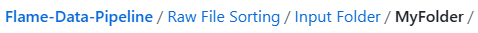

# Flame-Data-Pipeline
In this repository, three tools are released to help users sort, label, and extract/parse exif metadata from images/videos
captured using M30T and M2EA cameras/drones. 

### FLAME Image Labeling Tool
The FLAME Image Labeling Tool, when input with the output folder structure from the Raw File Sorting Tool,
will allow the user to efficiently manually label RGB/IR image pairs or label via TIFF thresholding, and will
output a file structure based on the labels.

### Raw File Sorting Tool
The Raw File Sorting tool, when input with raw M30T or M2EA image pairs and videos, will
pair the video, pair the thermal images to the wide angle images if available, regenerate the thermal images with a color
map (also creating tiffs). This is done for each sub folder in the input folder.
The pairings are sorted into Fire / No Fire folders.
Thermal TIFF image files are created, allowing for reliable ground truth for segmentation and other deep learning related tasks. 

### Image GPS Tracing Tool 
The Image GPS Tracing tool will sort a directory of images by date-time 
and returns a .csv file containing the following information for 
for each image found in the directory:

- Datetime
- Latitude
- Longitude
- Altitude [m ASL]
- Image Filename
- Path to Image

## Table of Contents

- [Requirements](#requirements)
- [Installation](#installation)
- [Usage](#usage)
- [Additional Contents](#additional-contents)
- [Known Bugs](#bugs)
- [Contributing](#contributing)
- [Acknowledgments](#acknowledgments)

## Requirements

The package versions listed are what were used when testing this tool. Therefore, this is the known configuration that
has been tested and works properly. Please note, each tool may work with different versions of these
packages, but other versions have not been confirmed.

### FLAME Image Labeling Tool
- Python 3.9.12 or higher
- Pip version 24.0 or higher
- opencv-python (using cv2) version 4.9.0.80
- PIL (pillow) version 10.2.0
- PySimpleGUI version 5.0.2
- numpy version 1.26.4

### Raw File Sorting Tool
- Windows 10 or higher
- Python 3.9.12 or higher
- Pip version 24.0 or higher
- exif version 1.6.0
- PIL (pillow) version 10.2.0
- matplotlib version 3.8.3
- seaborn version 0.13.2
- psutil version 5.9.8
- videoprops get-video-properties version 0.1.1

### Image GPS Tracing Tool 
- Python 3.9.12 or higher 
- exif version 1.6.0, to install run pip install exif

## Installation
### FLAME Image Labeling Tool
Download the GitHub source repository contents and navigate to the 'Labeling' folder, locating the
'FLAME Image Labeling.py' python script.

### Raw File Sorting Tool
Download the GitHub source repository contents and navigate to the 'Raw File Sorting' folder, locating the
'Raw File Sorting.py' python script.

### Image GPS Tracing Tool 
Download the GitHub source repository contents and navigate to the 'Image GPS Tracing' folder, locating the
'Image_GPS_Tracing.ipynb' python script.

## Usage
### FLAME Image Labeling Tool
As long as the necessary packages and correct versions are installed, running the 'FLAME Image Labeling Tool.py' file
in that Python environment should work. Please make sure the 'Output Folder' is empty.

If using the tools and not making changes for open source purposes, remove all .gitkeep files. These can cause tools to 
crash as the tools rely on handling folders and subfolders assuming only images/videos are in them.

For detailed instructions on how to use the FLAME Image Labeling Tool, please refer to the 'Help' tab found within the
tool itself. 

#### Input
Upon opening the tool, the user will be prompted to select the input image folder. Please use the Raw File Sorting Tool
first to receive the proper output file structure that should be input into this tool. The full output file structure is 
listed in the 'Raw File Sorting Tool' section of 'Usage'. 

The input folder for this tool should be as follows:
- Input Folder
    - Images
        - RGB
            - Corrected FOV
            - Raw
        - Thermal
            - Celsius TIFF
            - JPG

The tool will load the RGB / IR image pairs and the main application window will open. 

The user can manually scroll through each image pair with the 'Left' and 'Right' arrow keys.
To go to a specific index image pair, use the 'Go To' button an input an integer index. 

The user can label each image pair with the following scheme:
- '1' = Fire
- '2' = No Fire
- '3' = Unlabeled/Unknown

The user can apply a specific class category to every image pair by selecting from the dropdown at the top of the application and 
clicking 'Apply to All'.

The user can also apply labeling via temperature thresholding using the Thermal TIFF files, by clicking the 'Temperature Based Labeling' button and inputting a temperature to threshold at. 

The user can save the current state of the application by clicking the 'Save State' button. 
The user can reload the current state of the application by clicking the 'Load State' button, provided the save_state.txt file is still located in the current directory and the input folder has not changed. 

  
#### Output
After labeling all RGB/IR image pairs within the tool, click the 'Export Images w/ Labels' button and you will be prompted 
to either:
-Rename all files: This will rename all files according to an ascending numbering scheme and copy to the output folders
-Preserve input filenames: This will copy the files with their original names to the proper output folders

After running the FLAME Image Labeling Tool, a message box will appear to show the total of 'Fire', 'No Fire', and 'Unlabeled' image pair counts. After selecting 'OK', there should be a folder named 'Output Folder' containing the sorted output contents. 

The file structure for this folder is as follows:
- Output Folder
    -Fire 
        - RGB
            - Corrected FOV
            - Raw
    - Thermal
        - Celsius TIFF
            - JPG
    -No Fire 
        - RGB
            - Corrected FOV
            - Raw
    - Thermal
        - Celsius TIFF
            - JPG

For more information on how to use the FLAME Labeling Tool, click the help button in the top left hand corner. 

### Raw File Sorting Tool
As long as the necessary packages and correct versions are installed, running the 'Raw File Sorting.py' file
in that Python environment should work. Please make sure the 'Output Folder' is empty. Also, place input images/videos
into 'Input Folder/[MyFolderName]', where MyFolderName can be any folder name as long as it contains the images/videos
you would like to sort.

#### Input
Place input images/videos into 'Input Folder/[MyFolderName]', where MyFolderName can be any folder or subfolders name
as long as there are the images/videos you would like to sort.

Please Note:
- Images must be .jpg
- Videos must be .mp4 format
- No other filetypes are used
- Screen or zoom images/videos are discarded for now (not used)
- In 'Input Folder', only RGB/IR videos can exist
    - RGB wide angle images/videos must be named with a 'W'
        - Example: MyRGBImage_W.jpg or MyRGBVideo_W.mp4
    - Thermal images/videos must be names with a 'T'
        - Example: MyThermalImage_T.jpg or MyThermalVideo_T.mp4
- Thermal Videos must be 512 pixels in height resolution for M2EA camera
- FOR THE M2EA, DO NOT INPUT MORE RGB IMAGES THAN THERMALS.

#### Output
After running the Raw File Sorting Tool, there should be a folder named 'Output Folder' containing the sorted output
contents. The file structure for this folder is as follows:
- Output Folder
    - [Input Folder/Subfolder Name]
        - Images
            - RGB
                - Corrected FOV
                - Raw
            - Thermal
                - Celsius TIFF
                - JPG
        - Videos
            - RGB
            - Thermal

This output folder can now be used as input to the **FLAME Image Labeling Tool** included with this repository.

A log.txt file will also be generated on output and be placed in the main tool folder. It contains information about
the images that were paired together and what they were renamed to. Output will also be logged to the standard output screen.

### Image GPS Tracing Tool 
As long as the necessary packages and correct versions are installed, running the 'Image_GPS_Tracing.ipynb' file
in that Python environment should work using Jupyter Notebook. Please make sure the 'Output Folder' is empty.

#### Input 
The input file structure should be the following: 
- Input Folder
    - Images
        - RGB
        - Thermal
 
Please make sure the variable below is specified properly according to your input image file structure.

SOURCE_DIR = './Images/RGB/'

#### Output 
After running the file, the program will output a file named 'GPS_Traces.csv' containing the following information
for each image:

- Datetime
- Latitude
- Longitude
- Altitude [m ASL]
- Image Filename
- Path to Image

## Additional Contents
### FLAME Image Labeling Tool
No additional content. 
### Raw File Sorting Tool
The 'Example FOV Corrections' folder contains examples of FOV corrections for M30T and M2EA drone/cameras.

### Image GPS Tracing tool
No additional content. 

## Known Bugs
### FLAME Image Labeling Tool
No known bugs

### Raw File Sorting Tool
This program has a known memory leak. As a result, it is not recommended to process >3000 image pairs at a time.
Largest working batch: 3000 image pairs - 40,000 MiB peak RAM usage (as reported by task manager) - 2 hour runtime

### Image GPS Tracing Tool 
No known bugs

## Contributing

Thank you for considering contributing to our project! Here are some guidelines to help you get started:

### Bug Reports
If you encounter a bug or unexpected behavior, please open an issue on GitHub and include as much detail as possible, including steps to reproduce the issue and information about your environment.

### Feature Requests
If you have an idea for a new feature or improvement, please open an issue on GitHub to discuss it. We welcome suggestions from the community!

### Pull Requests
We welcome pull requests from everyone. Before submitting a pull request, please make sure your code adheres to our coding standards and passes any existing tests.
Once submitted, your pull request will be reviewed by a maintainer.

## Acknowledgements

We would like to thank the following individuals for their contributions to this project:
- Bryce Hopkins, Clemson University, for creation of the three tools released in this repository
- Dr. Fatemah Afghah, Clemson University, for supervision and support on the FLAME 3 Dataset/Project release
- Michael Marinaccio, Clemson University, for bug fixes and documentation of code
